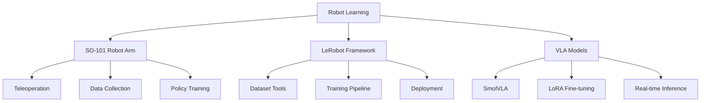

# 👋 Hi, I'm Jiaxuan Wang (王嘉璇)

**Robotics Engineer & Researcher | VLA Models | Robot Learning | Computer Vision**

[](https://github.com/1905185430)
[](https://github.com/1905185430)
[](https://github.com/1905185430)


## 🎥 Project Demonstrations

### 🎬 pi0.5 Model: Grasping Red Cube

**Project**: pi0.5 Model Grasping Demonstration  
**Technology**: pi0.5 + SO-101 Robot Arm  
**Task**: Robot grasping red cube  
**Result**: Successfully completed grasping task  
**Code**: [so101](https://github.com/1905185430/so101)

### 🎬 pi0.5 Model: Grasping Red Cube to Green Cube

**Project**: pi0.5 Model Grasping and Placement  
**Technology**: pi0.5 + SO-101 Robot Arm  
**Task**: Robot grasping red cube and placing it above green cube  
**Result**: Successfully completed grasping and placement task  
**Code**: [so101](https://github.com/1905185430/so101)

## 🎓 Education Background

**Huazhong University of Science and Technology (HUST)**  
*School of Electronic Information and Communications*  
*Bachelor of Engineering in Electronic Information Engineering*  
*2023.09 - 2027.06 (Expected)*

- **GPA**: 84.2/100 | **Ranking**: Top 30%
- **Elite Program**: Project-based Information Engineering ("Seed Class")
- **Core Courses**: Computer Programming (96), Digital Electronics (92), Stochastic Processes (92), Analog Electronics (85), Engineering Drawing (94)
- **Language**: CET-6 519, CET-4 585
- **Leadership**: Current Team Leader of Dian Team; Current Leader of Dian Team Robotics Group
- **Goal**: Direct PhD/PhD admission

## 📚 Publications & Academic Conferences

### Conference Papers
1. **Yefan Lin, Jiaxuan Wang, Baoyu Liu, Zheng Lv, and Xiaojun Hei**, "Pallet-ACT: A Unified Data-Training-Inference Framework for Industrial Robotic Palletizing." *7th Information Communication Technologies Conference (ICTC)*, Nanjing, China, May 2026. (Initial review passed)

2. **Yuhan Huang, Zijian Ning, Ziyuan Wang, Jiaxuan Wang, Xiaojun Hei**, "Reinforcement Learning with Stage-Wise Model Fusion for Sequential Object Manipulation Tasks." *IEEE International Conference on Robotics and Biomimetics (ROBIO)*, Chengdu, China, December 2025.

## 🛠️ Skills & Tools

### Programming Languages


### Robot Control & Real-world Implementation
- **6-Axis Robot Arms**: Extensive hands-on experience with debugging, deployment, and real-world operation
- **ROS2**: Proficient in ROS2 robot operating system and MoveIt 2 motion planning framework
- **AI Algorithms**: Expert in applying Reinforcement Learning (RL) and Imitation Learning (IL) for robot control

### Simulation & 3D Modeling
- **MuJoCo**: Proficient in physical simulation and testing for robotics
- **SolidWorks**: Expert in 3D modeling and product structure design with extensive 3D printing experience

### Development Environment & Tools
- **Operating Systems**: Linux environment proficiency
- **IDEs**: VSCode and other mainstream development environments
- **Tools**: VMware, Anaconda for development and environment management
- **AI Tools**: Skilled in using modern AI tools for programming, documentation, and research

## 🏆 Competitions & Research Projects

### 🥈 ICRA 2025 Sim2Real Challenge | **International Second Prize (Global 4th Place)**
As a core member of Team DianRobot, demonstrated excellent simulation-to-real transfer capabilities and algorithm control in complex continuous object manipulation tasks.

### 🔬 Intelligent Application Design of Chemical Experiment Robotic Arm Based on Imitation Learning | **Provincial Innovation Project (Ongoing)**
As the project core backbone and leader, deeply participated in the entire project progress, responsible for precise grasping of chemical experimental equipment by robotic arms. (Supervisor: Xiaojun Hei)

### 🥉 Reinforcement Learning Empowers Robot Coffee Service Application Design | **Regional Competition Second Prize (2024)**
Solved the joint zero-drift problem during coffee cup grasping through visual compensation, implemented finger positioning and grasping success determination using bounding box solutions.

### 🤖 Reinforcement Learning-based Robot Coffee Making | **Industry Collaboration Project (Completed)**
Participated in the horizontal project of CloudMinds Technology Co., Ltd., involved in robot coffee service design and system R&D, completed the construction of coffee-making demonstration process.

### 🎭 Dian Team Reception Robot Application Design | **University Innovation Project (Excellent Completion)**
Participated in the full-process application design of reception robots, dance action design and choreography. (Supervisors: Xiaojun Hei/Chengwei Zhang)

### 🧪 Embedded System Course Design: Smart Heating Coaster | **Core Developer (2025.09-2026.03)**
Participated in overall software and hardware development of smart heating coaster, led shell and structure design; proficiently used SolidWorks and other tools for shell development.

## 📖 Other Teaching & Engineering Project Experience

### 🎓 Core Course Construction Project
Participated in the construction of "Service Robot Application Design" course for Excellent Engineer Training (2026.1-2027.12, Ongoing).

### 📚 Textbook Construction Project
Participated in the compilation and construction of "Service Robot Application System Design and Experiment" textbook for Excellent Engineer Training (2026.1-2027.12, Ongoing).

### 🔬 Teaching Research Project
Participated in the teaching research project "Robot System for Integrated Industry-Education Graduate Professional Degree Based on Deep Integration" (2025.1-2026.12, Ongoing).

## 🔥 Featured Projects

### 🤖 SO-101 Robot Arm System
Comprehensive system for SO-101 dual-arm robot control, data collection, and model deployment.

**Technologies:** Python, LeRobot, PyTorch, OpenCV  
**Status:** 🚀 Active Development  
**GitHub:** [so101](https://github.com/1905185430/so101)

### 🎯 VLA Model Fine-tuning Pipeline
Tools and pipelines for fine-tuning Vision-Language-Action models.

**Technologies:** Python, LeRobot, PyTorch, Transformers  
**Status:** 🚀 Active Development  
**GitHub:** [vla-finetune](https://github.com/1905185430/vla-finetune)

### 📊 LeRobot Dataset & Documentation
Comprehensive documentation and tools for the LeRobot framework.

**Technologies:** Python, LeRobot, Markdown, Git  
**Status:** ✅ Completed  
**GitHub:** [lerobot_workdocs](https://github.com/1905185430/lerobot_workdocs)

### 🖥️ Custom Linux System
Building a minimal Linux system from scratch with custom kernel and initrd.

**Technologies:** Linux, Shell Scripting, QEMU  
**Status:** ✅ Completed  
**GitHub:** [custom-linux-system](https://github.com/1905185430/custom-linux-system)

## 🧠 LeRobot Framework Expertise

I have extensive experience with the **LeRobot framework** for robot learning. My expertise includes:

### 🎯 Core Competencies
- **Data Collection**: 100+ episodes using LeRobot format
- **Policy Training**: ACT, SmolVLA, Diffusion Policy
- **Model Deployment**: Real-time inference on physical robots
- **Tool Development**: Custom utilities and extensions

### 📊 Technical Proficiency
```
Dataset Collection:     ████████████ 100%
Policy Training:        ████████░░░░ 80%
Real-world Deployment:  ████████░░░░ 80%
Tool Development:       ████████████ 100%
Documentation:          ████████████ 100%
```

## 📝 Latest Blog Posts

<!-- BLOG-POST-LIST:START -->
- [Welcome to My Technical Blog](https://1905185430.github.io/blog/2026/04/26/welcome-to-my-website/)
- [SO-101 Robot Arm System Overview](https://1905185430.github.io/blog/2026/04/26/so101-overview/)
- [VLA Model Fine-tuning Guide](https://1905185430.github.io/blog/2026/04/26/vla-finetuning-guide/)
<!-- BLOG-POST-LIST:END -->

➡️ [more blog posts...](https://1905185430.github.io/blog)

## 🎯 Current Focus



## 🤝 Let's Connect

[](https://github.com/1905185430)
[](mailto:wangjx_hust@hust.edu.cn)
[](https://1905185430.github.io)

**Contact Information:**
- **Phone**: 18879965616
- **Email**: wangjx_hust@hust.edu.cn
- **GitHub**: [github.com/1905185430](https://github.com/1905185430)
- **Website**: [1905185430.github.io](https://1905185430.github.io)

## 📈 Visitor Count


---

⭐️ From [1905185430](https://github.com/1905185430) | 🤖 **Building the future of robotics, one line of code at a time!**

