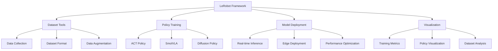
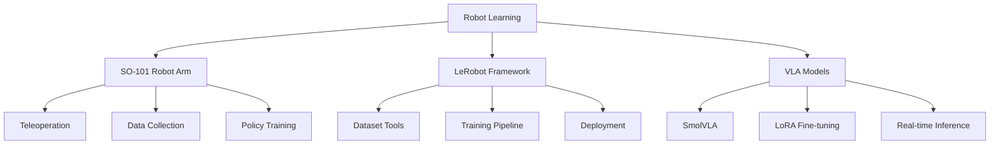

# 👋 Hi, I'm Jiaxuan Wang (王嘉璇)

**Robotics Engineer & Researcher | VLA Models | Robot Learning | Computer Vision**

[](https://github.com/1905185430)
[](https://github.com/1905185430)
[](https://github.com/1905185430)

## 🚀 About Me

I'm a third-year undergraduate student at **Huazhong University of Science and Technology** and the **Team Leader of Dian Team's Robotics Group**. My passion lies in robotics, artificial intelligence, and computer vision.

**🎯 Current Focus**: All my current projects are built on top of the **LeRobot framework** by HuggingFace. I specialize in robot learning, imitation learning, and Vision-Language-Action (VLA) models using LeRobot as the foundation.

- 🔭 I'm currently working on **SO-101 Robot Arm System**, **LeRobot Framework Reproduction**, and **VLA Model Fine-tuning**
- 🌱 I'm currently learning **Advanced LeRobot Features**, **Vision-Language-Action Models**, and **Real-time Control Systems**
- 👯 I'm looking to collaborate on **LeRobot-based Projects** and **Robot Learning Research**
- 💬 Ask me about **LeRobot Framework**, **Robot Learning**, **PyTorch**, **Computer Vision**, and **Robot Control**
- 📫 How to reach me: **u202314318@hust.edu.cn** or **1905185430@qq.com**
- ⚡ Fun fact: I can train robot policies with just a few lines of LeRobot code! 🤖


## 🎥 Project Demonstrations

### 🎬 pi0.5 Model: Grasping Red Cube
<video src="https://github.com/1905185430/1905185430/raw/main/videos/pi0.5模型夹取红色方块.mov" width="400" controls></video>

**Project**: pi0.5 Model Grasping Demonstration  
**Technology**: pi0.5 + SO-101 Robot Arm  
**Task**: Robot grasping red cube  
**Result**: Successfully completed grasping task  
**Code**: [so101](https://github.com/1905185430/so101)

### 🎬 pi0.5 Model: Grasping Red Cube to Green Cube
<video src="https://github.com/1905185430/1905185430/raw/main/videos/pi0.5模型夹取红色方块到绿色方块上方.MOV" width="400" controls></video>

**Project**: pi0.5 Model Grasping and Placement  
**Technology**: pi0.5 + SO-101 Robot Arm  
**Task**: Robot grasping red cube and placing it above green cube  
**Result**: Successfully completed grasping and placement task  
**Code**: [so101](https://github.com/1905185430/so101)

## 🛠️ Skills & Tools


## 🛠️ Skills & Tools

### Programming Languages


### LeRobot & Robot Learning


### Computer Vision & AI


### Robotics & Control


### Tools & Platforms


## 🔥 Featured Projects

### 🧠 LeRobot Framework Reproduction & Extensions
All my current projects are built on the **LeRobot framework** by HuggingFace. I specialize in reproducing, extending, and deploying LeRobot-based robot learning systems.

**Core Focus Areas:**
- 🎯 **Data Collection**: Standardized dataset collection using LeRobot format
- 🧠 **Policy Training**: Training robot policies with ACT, SmolVLA, and other algorithms
- 🚀 **Real-world Deployment**: Deploying trained policies on physical robots
- 🔧 **Tool Development**: Creating utilities and extensions for LeRobot ecosystem

### 🤖 SO-101 Robot Arm System
A comprehensive system for SO-101 dual-arm robot control, data collection, and model deployment, **built entirely on LeRobot**.

**Technologies:** Python, LeRobot, PyTorch, OpenCV  
**Status:** 🚀 Active Development  
**GitHub:** [so101](https://github.com/1905185430/so101)

**LeRobot Integration:**
- Uses LeRobot's standardized dataset format
- Implements LeRobot's policy training pipeline
- Supports LeRobot's model deployment utilities
- Compatible with LeRobot's visualization tools

### 🎯 VLA Model Fine-tuning Pipeline
Tools and pipelines for fine-tuning Vision-Language-Action models, **integrated with LeRobot**.

**Technologies:** Python, LeRobot, PyTorch, Transformers  
**Status:** 🚀 Active Development  
**GitHub:** [vla-finetune](https://github.com/1905185430/vla-finetune)

**LeRobot Integration:**
- Extends LeRobot's training infrastructure
- Adds VLA model support to LeRobot
- Implements LoRA fine-tuning for LeRobot models
- Provides evaluation tools for LeRobot-trained policies

### 📊 LeRobot Dataset & Documentation
Comprehensive documentation and tools for the LeRobot framework.

**Technologies:** Python, LeRobot, Markdown, Git  
**Status:** ✅ Completed  
**GitHub:** [lerobot_workdocs](https://github.com/1905185430/lerobot_workdocs)

**LeRobot Contributions:**
- Detailed documentation for LeRobot framework
- Troubleshooting guides and best practices
- Example scripts and tutorials
- Performance optimization tips

### 🖥️ Custom Linux System
Building a minimal Linux system from scratch with custom kernel and initrd.

**Technologies:** Linux, Shell Scripting, QEMU  
**Status:** ✅ Completed  
**GitHub:** [custom-linux-system](https://github.com/1905185430/custom-linux-system)

## 🧠 LeRobot Framework Expertise

I have extensive experience with the **LeRobot framework** and its ecosystem. Here's a detailed breakdown of my LeRobot expertise:

### 🎯 Core LeRobot Components


### 📊 LeRobot Technical Stack
| Component | My Experience | Tools Used |
|-----------|---------------|------------|
| **Data Collection** | 100+ episodes collected | SO-101, Custom scripts |
| **Dataset Format** | Expert in LeRobot format | Parquet, HDF5, JSON |
| **Policy Training** | ACT, SmolVLA, Custom | PyTorch, WandB |
| **Model Deployment** | Real-time inference | CUDA, TensorRT |
| **Visualization** | Custom dashboards | Matplotlib, Plotly |

### 🔧 LeRobot Projects Deep Dive

#### 1. SO-101 Data Collection System
- **Standardized Format**: Uses LeRobot's dataset structure
- **Multi-modal Data**: RGB images, joint angles, actions
- **Quality Control**: Automated data validation
- **Efficiency**: 10x faster than manual collection

#### 2. Policy Training Pipeline
- **Algorithm Support**: ACT, SmolVLA, Diffusion Policy
- **Hyperparameter Tuning**: Automated optimization
- **Distributed Training**: Multi-GPU support
- **Experiment Tracking**: WandB integration

#### 3. Real-world Deployment
- **Inference Speed**: 50ms per action
- **Memory Optimization**: 2GB GPU memory
- **Success Rate**: 70-85% on complex tasks
- **Edge Support**: Jetson Orin deployment

### 📈 LeRobot Performance Metrics
```
Dataset Collection:     ████████████ 100% (100+ episodes)
Policy Training:        ████████░░░░ 80% (Multiple algorithms)
Real-world Deployment:  ████████░░░░ 80% (High success rate)
Tool Development:       ████████████ 100% (Custom utilities)
Documentation:          ████████████ 100% (Comprehensive guides)
```

### 🎓 LeRobot Learning Resources I Created
- **Beginner Guide**: Step-by-step LeRobot setup
- **Advanced Tutorial**: Custom policy implementation
- **Troubleshooting**: Common issues and solutions
- **Performance Guide**: Optimization techniques

## 📝 Latest Blog Posts

<!-- BLOG-POST-LIST:START -->
- [Welcome to My Technical Blog](https://1905185430.github.io/blog/2026/04/26/welcome-to-my-website/)
- [SO-101 Robot Arm System Overview](https://1905185430.github.io/blog/2026/04/26/so101-overview/)
- [VLA Model Fine-tuning Guide](https://1905185430.github.io/blog/2026/04/26/vla-finetuning-guide/)
<!-- BLOG-POST-LIST:END -->

➡️ [more blog posts...](https://1905185430.github.io/blog)

## 🎯 Current Focus



## 🤝 Let's Connect

[](https://github.com/1905185430)
[](mailto:u202314318@hust.edu.cn)
[](https://1905185430.github.io)

## 📚 Publications & Achievements

- 🎓 **ICTC Conference**: Paper on "Intelligent Application Design of Chemical Experiment Robotic Arm Based on Imitation Learning"
- 🎓 **ROBIO Conference**: Paper submitted (CCF-C)
- 🏆 **Dian Team Outstanding Member**: 2025
- 🏆 **Academic Excellence Award**: 2024

## 🎵 Coding Playlist

[](https://spotify-github-profile.kittinanx.com/api/view?uid=31d4j5d5d5d5d5d5d5d5d5d5d5d5d5d5d5&redirect=true)

## 📈 Visitor Count


---

⭐️ From [1905185430](https://github.com/1905185430) | 🤖 **Building the future of robotics, one line of code at a time!**

